# 🗄️ 데이터베이스 ERD

> **버전**: v1.0.0  
> **작성일**: 2026-01-29  
> **기반 문서**: [api-specification.md](./api-specification.md)

---

## 1. ERD 다이어그램

```mermaid
erDiagram
    USER ||--o{ ELDER : manages
    USER ||--o{ NOTIFICATION : receives
    ELDER ||--|| ROBOT : has
    ELDER ||--o{ MEDICATION : takes
    ELDER ||--o{ MEDICATION_RECORD : has
    ELDER ||--o{ SCHEDULE : has
    ELDER ||--o{ ACTIVITY : logs
    ELDER ||--o{ EMERGENCY : triggers
    ELDER ||--o{ EMERGENCY_CONTACT : has
    ROBOT ||--o{ PATROL_RESULT : performs
    ROBOT ||--o{ PATROL_ITEM : checks
    ROBOT ||--o{ ROBOT_COMMAND : receives
    ROBOT ||--o{ ROBOT_EVENT : reports
    ELDER ||--o{ AI_REPORT : has
    ELDER ||--|| ROOM_MAP : has

    USER {
        bigint id PK
        varchar name
        varchar email UK
        varchar password
        varchar phone
        enum role "WORKER, FAMILY"
        json notification_settings
        enum theme "SYSTEM, LIGHT, DARK"
        datetime created_at
        datetime updated_at
    }

    ELDER {
        bigint id PK
        bigint user_id FK
        varchar name
        date birth_date
        enum gender "MALE, FEMALE"
        varchar address
        enum status "SAFE, WARNING, DANGER"
        datetime last_activity_at
        varchar last_location
        datetime created_at
        datetime updated_at
    }

    EMERGENCY_CONTACT {
        bigint id PK
        bigint elder_id FK
        varchar name
        varchar phone
        varchar relation
        int priority
    }

    ROBOT {
        bigint id PK
        bigint elder_id FK
        varchar serial_number UK
        varchar auth_code
        int battery_level
        boolean is_charging
        enum network_status "CONNECTED, DISCONNECTED"
        varchar current_location
        enum lcd_mode "IDLE, GREETING, MEDICATION..."
        varchar lcd_emotion
        varchar lcd_message
        int dispenser_remaining
        int dispenser_capacity
        time morning_medication_time
        time evening_medication_time
        int tts_volume
        time patrol_start_time
        time patrol_end_time
        datetime last_sync_at
        datetime created_at
        datetime updated_at
    }

    MEDICATION {
        bigint id PK
        bigint elder_id FK
        varchar name
        varchar dosage
        enum frequency "MORNING, EVENING, BOTH"
        varchar timing
        varchar color
        date start_date
        date end_date
        boolean is_active
        datetime created_at
    }

    MEDICATION_RECORD {
        bigint id PK
        bigint elder_id FK
        bigint medication_id FK
        date record_date
        enum time_of_day "MORNING, EVENING"
        enum status "TAKEN, MISSED, PENDING"
        datetime taken_at
        enum method "DISPENSER, BUTTON, MANUAL"
        datetime created_at
    }

    SCHEDULE {
        bigint id PK
        bigint elder_id FK
        varchar title
        text description
        datetime scheduled_at
        varchar location
        enum type "HOSPITAL, MEDICATION, PERSONAL, FAMILY, OTHER"
        enum source "MANUAL, VOICE, SYSTEM"
        text voice_original
        enum status "UPCOMING, COMPLETED, CANCELLED"
        int remind_before_minutes
        datetime created_at
        datetime updated_at
    }

    ACTIVITY {
        bigint id PK
        bigint elder_id FK
        enum type "WAKE_UP, SLEEP, MEDICATION_TAKEN..."
        varchar title
        text description
        varchar location
        float confidence
        datetime detected_at
        datetime created_at
    }

    EMERGENCY {
        bigint id PK
        bigint elder_id FK
        bigint robot_id FK
        enum type "FALL_DETECTED, NO_RESPONSE, SOS_BUTTON, UNUSUAL_PATTERN"
        varchar location
        float confidence
        json sensor_data
        enum resolution "PENDING, FALSE_ALARM, RESOLVED, EMERGENCY_CALLED, FAMILY_CONTACTED"
        text resolution_note
        datetime detected_at
        datetime resolved_at
        datetime created_at
    }

    NOTIFICATION {
        bigint id PK
        bigint user_id FK
        bigint elder_id FK
        enum type "EMERGENCY, MEDICATION, SCHEDULE, ACTIVITY, SYSTEM"
        varchar title
        text message
        varchar action_url
        boolean is_read
        datetime created_at
    }

    PATROL_RESULT {
        bigint id PK
        bigint robot_id FK
        bigint elder_id FK
        varchar patrol_id UK
        datetime started_at
        datetime completed_at
        datetime created_at
    }

    PATROL_ITEM {
        bigint id PK
        bigint patrol_result_id FK
        enum target "GAS_VALVE, DOOR, OUTLET, WINDOW, APPLIANCE"
        varchar label
        enum status "NORMAL, LOCKED, UNLOCKED, ON, OFF, NEEDS_CHECK"
        float confidence
        varchar image_url
        datetime checked_at
    }

    ROBOT_COMMAND {
        bigint id PK
        bigint robot_id FK
        varchar command_id UK
        enum command "MOVE_TO, START_PATROL, RETURN_TO_DOCK, SPEAK, CHANGE_LCD_MODE"
        json params
        enum status "PENDING, RECEIVED, IN_PROGRESS, COMPLETED, FAILED, CANCELLED"
        json result
        datetime issued_at
        datetime completed_at
        datetime created_at
    }

    ROBOT_EVENT {
        bigint id PK
        bigint robot_id FK
        bigint elder_id FK
        enum type "WAKE_UP, SLEEP, OUT_DETECTED, RETURN_DETECTED, CONVERSATION"
        json data
        float confidence
        varchar location
        datetime detected_at
        datetime created_at
    }

    AI_REPORT {
        bigint id PK
        bigint elder_id FK
        date report_date
        date period_start
        date period_end
        text summary
        json metrics
        json top_keywords
        json recommendations
        datetime generated_at
        datetime created_at
    }

    ROOM_MAP {
        bigint id PK
        bigint elder_id FK
        varchar map_id UK
        json rooms
        text map_html
        varchar map_image_url
        datetime captured_at
        datetime processed_at
        datetime created_at
        datetime updated_at
    }
```



---

## 2. 테이블 상세

### 2.1 USER (사용자)

| 컬럼 | 타입 | 설명 |
|------|------|------|
| `id` | BIGINT PK | 사용자 ID |
| `name` | VARCHAR(50) | 이름 |
| `email` | VARCHAR(100) UK | 이메일 (로그인 ID) |
| `password` | VARCHAR(255) | 암호화된 비밀번호 |
| `phone` | VARCHAR(20) | 연락처 |
| `role` | ENUM | WORKER(복지사), FAMILY(가족) |
| `notification_settings` | JSON | 알림 설정 |
| `theme` | ENUM | SYSTEM, LIGHT, DARK |
| `created_at` | DATETIME | 생성일 |
| `updated_at` | DATETIME | 수정일 |

---

### 2.2 ELDER (어르신)

| 컬럼 | 타입 | 설명 |
|------|------|------|
| `id` | BIGINT PK | 어르신 ID |
| `user_id` | BIGINT FK | 담당 사용자 |
| `name` | VARCHAR(50) | 이름 |
| `birth_date` | DATE | 생년월일 |
| `gender` | ENUM | MALE, FEMALE |
| `address` | VARCHAR(255) | 주소 |
| `status` | ENUM | SAFE, WARNING, DANGER |
| `last_activity_at` | DATETIME | 마지막 활동 시간 |
| `last_location` | VARCHAR(50) | 마지막 위치 |
| `created_at` | DATETIME | 생성일 |
| `updated_at` | DATETIME | 수정일 |

---

### 2.3 ROBOT (로봇)

| 컬럼 | 타입 | 설명 |
|------|------|------|
| `id` | BIGINT PK | 로봇 ID |
| `elder_id` | BIGINT FK | 담당 어르신 |
| `serial_number` | VARCHAR(50) UK | 시리얼 번호 |
| `auth_code` | VARCHAR(10) | 인증 코드 |
| `battery_level` | INT | 배터리 (0-100) |
| `is_charging` | BOOLEAN | 충전 중 여부 |
| `network_status` | ENUM | CONNECTED, DISCONNECTED |
| `current_location` | VARCHAR(50) | 현재 위치 |
| `lcd_mode` | ENUM | IDLE, GREETING, MEDICATION... |
| `lcd_emotion` | VARCHAR(20) | neutral, happy, angry... |
| `lcd_message` | VARCHAR(255) | LCD 메시지 |
| `dispenser_remaining` | INT | 디스펜서 잔량 |
| `dispenser_capacity` | INT | 디스펜서 용량 |
| `morning_medication_time` | TIME | 아침 복약 시간 |
| `evening_medication_time` | TIME | 저녁 복약 시간 |
| `tts_volume` | INT | TTS 볼륨 (0-100) |
| `patrol_start_time` | TIME | 순찰 시작 시간 |
| `patrol_end_time` | TIME | 순찰 종료 시간 |
| `last_sync_at` | DATETIME | 마지막 동기화 |
| `created_at` | DATETIME | 생성일 |
| `updated_at` | DATETIME | 수정일 |

---

### 2.4 MEDICATION (약)

| 컬럼 | 타입 | 설명 |
|------|------|------|
| `id` | BIGINT PK | 약 ID |
| `elder_id` | BIGINT FK | 어르신 |
| `name` | VARCHAR(100) | 약 이름 |
| `dosage` | VARCHAR(50) | 용량 (예: "1정") |
| `frequency` | ENUM | MORNING, EVENING, BOTH |
| `timing` | VARCHAR(50) | 복용 시점 (예: "식후 30분") |
| `color` | VARCHAR(20) | 약 색상 |
| `start_date` | DATE | 복용 시작일 |
| `end_date` | DATE | 복용 종료일 (NULL=무기한) |
| `is_active` | BOOLEAN | 활성 여부 |
| `created_at` | DATETIME | 생성일 |

---

### 2.5 MEDICATION_RECORD (복약 기록)

| 컬럼 | 타입 | 설명 |
|------|------|------|
| `id` | BIGINT PK | 기록 ID |
| `elder_id` | BIGINT FK | 어르신 |
| `medication_id` | BIGINT FK | 약 |
| `record_date` | DATE | 날짜 |
| `time_of_day` | ENUM | MORNING, EVENING |
| `status` | ENUM | TAKEN, MISSED, PENDING |
| `taken_at` | DATETIME | 복용 시간 |
| `method` | ENUM | DISPENSER, BUTTON, MANUAL |
| `created_at` | DATETIME | 생성일 |

> **인덱스**: `(elder_id, record_date)`, `(medication_id, record_date)`

---

### 2.6 SCHEDULE (일정)

| 컬럼 | 타입 | 설명 |
|------|------|------|
| `id` | BIGINT PK | 일정 ID |
| `elder_id` | BIGINT FK | 어르신 |
| `title` | VARCHAR(100) | 제목 |
| `description` | TEXT | 설명 |
| `scheduled_at` | DATETIME | 일정 시간 |
| `location` | VARCHAR(100) | 장소 |
| `type` | ENUM | HOSPITAL, MEDICATION, PERSONAL, FAMILY, OTHER |
| `source` | ENUM | MANUAL, VOICE, SYSTEM |
| `voice_original` | TEXT | 원본 음성 텍스트 |
| `status` | ENUM | UPCOMING, COMPLETED, CANCELLED |
| `remind_before_minutes` | INT | 사전 알림 (분) |
| `created_at` | DATETIME | 생성일 |
| `updated_at` | DATETIME | 수정일 |

> **인덱스**: `(elder_id, scheduled_at)`, `(elder_id, source)`

---

### 2.7 ACTIVITY (활동 로그)

| 컬럼 | 타입 | 설명 |
|------|------|------|
| `id` | BIGINT PK | 활동 ID |
| `elder_id` | BIGINT FK | 어르신 |
| `type` | ENUM | WAKE_UP, SLEEP, MEDICATION_TAKEN, PATROL_COMPLETE... |
| `title` | VARCHAR(100) | 제목 |
| `description` | TEXT | 설명 |
| `location` | VARCHAR(50) | 위치 |
| `confidence` | FLOAT | 신뢰도 (0-1) |
| `detected_at` | DATETIME | 감지 시간 |
| `created_at` | DATETIME | 생성일 |

> **인덱스**: `(elder_id, detected_at)`

---

### 2.8 EMERGENCY (긴급 상황)

| 컬럼 | 타입 | 설명 |
|------|------|------|
| `id` | BIGINT PK | 긴급 상황 ID |
| `elder_id` | BIGINT FK | 어르신 |
| `robot_id` | BIGINT FK | 로봇 |
| `type` | ENUM | FALL_DETECTED, NO_RESPONSE, SOS_BUTTON, UNUSUAL_PATTERN |
| `location` | VARCHAR(50) | 발생 위치 |
| `confidence` | FLOAT | 신뢰도 |
| `sensor_data` | JSON | 센서 데이터 |
| `resolution` | ENUM | PENDING, FALSE_ALARM, RESOLVED... |
| `resolution_note` | TEXT | 해결 메모 |
| `detected_at` | DATETIME | 감지 시간 |
| `resolved_at` | DATETIME | 해결 시간 |
| `created_at` | DATETIME | 생성일 |

---

### 2.9 NOTIFICATION (알림)

| 컬럼 | 타입 | 설명 |
|------|------|------|
| `id` | BIGINT PK | 알림 ID |
| `user_id` | BIGINT FK | 수신 사용자 |
| `elder_id` | BIGINT FK | 관련 어르신 |
| `type` | ENUM | EMERGENCY, MEDICATION, SCHEDULE, ACTIVITY, SYSTEM |
| `title` | VARCHAR(100) | 제목 |
| `message` | TEXT | 메시지 |
| `action_url` | VARCHAR(255) | 액션 URL |
| `is_read` | BOOLEAN | 읽음 여부 |
| `created_at` | DATETIME | 생성일 |

> **인덱스**: `(user_id, is_read, created_at)`

---

### 2.10 PATROL_RESULT (순찰 결과)

| 컬럼 | 타입 | 설명 |
|------|------|------|
| `id` | BIGINT PK | 순찰 결과 ID |
| `robot_id` | BIGINT FK | 로봇 |
| `elder_id` | BIGINT FK | 어르신 |
| `patrol_id` | VARCHAR(50) UK | 순찰 고유 ID |
| `started_at` | DATETIME | 시작 시간 |
| `completed_at` | DATETIME | 완료 시간 |
| `created_at` | DATETIME | 생성일 |

---

### 2.11 PATROL_ITEM (순찰 항목)

| 컬럼 | 타입 | 설명 |
|------|------|------|
| `id` | BIGINT PK | 항목 ID |
| `patrol_result_id` | BIGINT FK | 순찰 결과 |
| `target` | ENUM | GAS_VALVE, DOOR, OUTLET, WINDOW, APPLIANCE |
| `label` | VARCHAR(50) | 라벨 (예: "가스밸브") |
| `status` | ENUM | NORMAL, LOCKED, UNLOCKED, ON, OFF, NEEDS_CHECK |
| `confidence` | FLOAT | 신뢰도 |
| `image_url` | VARCHAR(255) | 이미지 URL |
| `checked_at` | DATETIME | 확인 시간 |

---

### 2.12 ROBOT_COMMAND (로봇 명령)

| 컬럼 | 타입 | 설명 |
|------|------|------|
| `id` | BIGINT PK | 명령 ID |
| `robot_id` | BIGINT FK | 로봇 |
| `command_id` | VARCHAR(50) UK | 명령 고유 ID |
| `command` | ENUM | MOVE_TO, START_PATROL, RETURN_TO_DOCK, SPEAK, CHANGE_LCD_MODE |
| `params` | JSON | 명령 파라미터 |
| `status` | ENUM | PENDING, RECEIVED, IN_PROGRESS, COMPLETED, FAILED, CANCELLED |
| `result` | JSON | 실행 결과 |
| `issued_at` | DATETIME | 발행 시간 |
| `completed_at` | DATETIME | 완료 시간 |
| `created_at` | DATETIME | 생성일 |

---

### 2.13 AI_REPORT (AI 리포트)

| 컬럼 | 타입 | 설명 |
|------|------|------|
| `id` | BIGINT PK | 리포트 ID |
| `elder_id` | BIGINT FK | 어르신 |
| `report_date` | DATE | 리포트 날짜 |
| `period_start` | DATE | 분석 기간 시작 |
| `period_end` | DATE | 분석 기간 종료 |
| `summary` | TEXT | 요약 |
| `metrics` | JSON | 지표 데이터 |
| `top_keywords` | JSON | 주요 키워드 |
| `recommendations` | JSON | 추천사항 |
| `generated_at` | DATETIME | 생성 시간 |
| `created_at` | DATETIME | 생성일 |

---

### 2.14 ROOM_MAP (안심 지도)

| 컬럼 | 타입 | 설명 |
|------|------|------|
| `id` | BIGINT PK | 지도 ID |
| `elder_id` | BIGINT FK | 어르신 |
| `map_id` | VARCHAR(50) UK | 지도 고유 ID |
| `rooms` | JSON | 방 정보 (bounds, type 등) |
| `map_html` | TEXT | 렌더링된 HTML |
| `map_image_url` | VARCHAR(255) | 원본 이미지 URL |
| `captured_at` | DATETIME | 캡처 시간 |
| `processed_at` | DATETIME | 처리 완료 시간 |
| `created_at` | DATETIME | 생성일 |
| `updated_at` | DATETIME | 수정일 |

---

## 3. Enum 정의

### 3.1 User 관련
```sql
CREATE TYPE user_role AS ENUM ('WORKER', 'FAMILY');
CREATE TYPE theme_mode AS ENUM ('SYSTEM', 'LIGHT', 'DARK');
```

### 3.2 Elder 관련
```sql
CREATE TYPE elder_status AS ENUM ('SAFE', 'WARNING', 'DANGER');
CREATE TYPE gender AS ENUM ('MALE', 'FEMALE');
```

### 3.3 Robot 관련
```sql
CREATE TYPE network_status AS ENUM ('CONNECTED', 'DISCONNECTED');
CREATE TYPE lcd_mode AS ENUM ('IDLE', 'GREETING', 'MEDICATION', 'SCHEDULE', 'LISTENING', 'EMERGENCY', 'SLEEP');
```

### 3.4 Medication 관련
```sql
CREATE TYPE medication_frequency AS ENUM ('MORNING', 'EVENING', 'BOTH');
CREATE TYPE medication_status AS ENUM ('TAKEN', 'MISSED', 'PENDING');
CREATE TYPE medication_method AS ENUM ('DISPENSER', 'BUTTON', 'MANUAL');
```

### 3.5 Schedule 관련
```sql
CREATE TYPE schedule_type AS ENUM ('HOSPITAL', 'MEDICATION', 'PERSONAL', 'FAMILY', 'OTHER');
CREATE TYPE schedule_source AS ENUM ('MANUAL', 'VOICE', 'SYSTEM');
CREATE TYPE schedule_status AS ENUM ('UPCOMING', 'COMPLETED', 'CANCELLED');
```

### 3.6 Activity 관련
```sql
CREATE TYPE activity_type AS ENUM (
  'WAKE_UP', 'SLEEP', 'MEDICATION_TAKEN', 'MEDICATION_MISSED',
  'PATROL_COMPLETE', 'OUT_DETECTED', 'RETURN_DETECTED', 'CONVERSATION', 'EMERGENCY'
);
```

### 3.7 Emergency 관련
```sql
CREATE TYPE emergency_type AS ENUM ('FALL_DETECTED', 'NO_RESPONSE', 'SOS_BUTTON', 'UNUSUAL_PATTERN');
CREATE TYPE emergency_resolution AS ENUM ('PENDING', 'FALSE_ALARM', 'RESOLVED', 'EMERGENCY_CALLED', 'FAMILY_CONTACTED');
```

### 3.8 Notification 관련
```sql
CREATE TYPE notification_type AS ENUM ('EMERGENCY', 'MEDICATION', 'SCHEDULE', 'ACTIVITY', 'SYSTEM');
```

### 3.9 Patrol 관련
```sql
CREATE TYPE patrol_target AS ENUM ('GAS_VALVE', 'DOOR', 'OUTLET', 'WINDOW', 'APPLIANCE');
CREATE TYPE patrol_status AS ENUM ('NORMAL', 'LOCKED', 'UNLOCKED', 'ON', 'OFF', 'NEEDS_CHECK');
```

### 3.10 Command 관련
```sql
CREATE TYPE command_type AS ENUM ('MOVE_TO', 'START_PATROL', 'RETURN_TO_DOCK', 'SPEAK', 'CHANGE_LCD_MODE');
CREATE TYPE command_status AS ENUM ('PENDING', 'RECEIVED', 'IN_PROGRESS', 'COMPLETED', 'FAILED', 'CANCELLED');
```

---

## 4. 인덱스 전략

### 4.1 자주 조회되는 패턴

```sql
-- 어르신별 최근 활동
CREATE INDEX idx_activity_elder_detected ON activity(elder_id, detected_at DESC);

-- 어르신별 일정 조회
CREATE INDEX idx_schedule_elder_date ON schedule(elder_id, scheduled_at);

-- 어르신별 복약 기록
CREATE INDEX idx_medication_record_elder_date ON medication_record(elder_id, record_date);

-- 사용자별 안읽은 알림
CREATE INDEX idx_notification_user_unread ON notification(user_id, is_read, created_at DESC);

-- 로봇별 대기 중인 명령
CREATE INDEX idx_robot_command_pending ON robot_command(robot_id, status) WHERE status = 'PENDING';

-- 어르신별 미해결 긴급 상황
CREATE INDEX idx_emergency_elder_pending ON emergency(elder_id, resolution) WHERE resolution = 'PENDING';
```

---

## 5. 관계 요약

```
USER (1) ────< ELDER (N)
              │
              ├──1:1── ROBOT
              │         └──< PATROL_RESULT ──< PATROL_ITEM
              │         └──< ROBOT_COMMAND
              │         └──< ROBOT_EVENT
              │
              ├──< MEDICATION ──< MEDICATION_RECORD
              ├──< SCHEDULE
              ├──< ACTIVITY
              ├──< EMERGENCY
              ├──< EMERGENCY_CONTACT
              ├──< AI_REPORT
              └──1:1── ROOM_MAP

USER (1) ────< NOTIFICATION (N)
```

---

## 6. 변경 이력

| 버전 | 날짜 | 변경 내용 |
|------|------|----------|
| 1.0.0 | 2026-01-29 | 초안 작성 |
