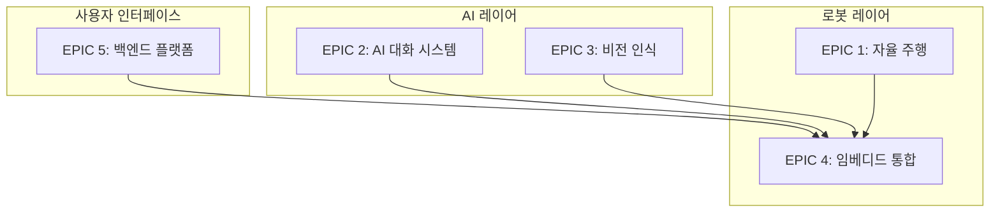
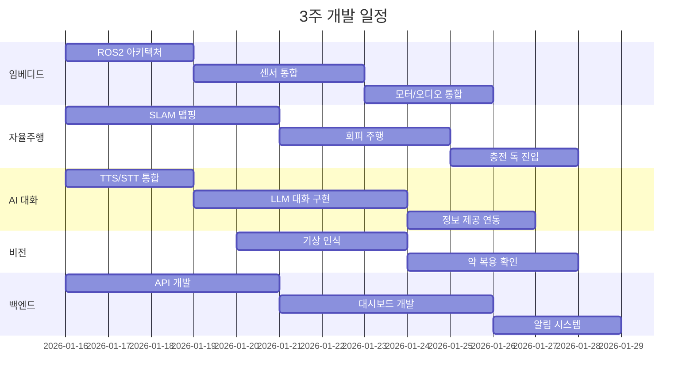

# 🤖 AI 동반자 로봇 - Jira 에픽 구조

## 📋 프로젝트 개요

| 항목 | 내용 |
|------|------|
| **기간** | 3 ~ 3.5주 |
| **팀 규모** | 6명 |
| **목표** | 독거노인 AI 동반자 로봇 MVP 개발 |

### 팀 구성
| 팀원 | 역할 | 주요 기술 |
|------|------|----------|
| 학기 | Visual SLAM | SLAM, ROS2 |
| 동완 | 임베디드 SW 통합 | ROS2, 센서 드라이버 |
| 민규 | 임베디드 H/W | 하드웨어 제어, IoT |
| 승환 | 풀스택 | Spring Boot, React.js, MySQL |
| 건도 | LLM | LLM API, PostgreSQL |
| 진훈 | Vision + 자율주행 | YOLO, 경로 계획 |

### 기술 스택
| 레이어 | 기술 |
|--------|------|
| Backend | Spring Boot (Java) |
| Frontend | React.js |
| DB | MySQL (백엔드), PostgreSQL (LLM) |
| 임베디드 | Jetson Orin Nano, Raspberry Pi, ROS2 |
| 하드웨어 | RC Car, Camera, LiDAR, Speaker |

---

## 🎯 추상화 과정 (3단계)

### Level 0 → Level 1: 기능 그룹화
```
세부 기능 40+개 → 기능 그룹 10개
```

### Level 1 → Level 2: 시스템 모듈화
```
기능 그룹 10개 → 시스템 모듈 6개
```

### Level 2 → Level 3: 에픽 도출
```
시스템 모듈 6개 → 에픽 5개 (3주 일정 고려 통합)
```

> [!IMPORTANT]
> 3주라는 짧은 기간을 고려하여 원래 6개였던 에픽을 **5개로 통합**했습니다.
> IoT/스마트홈 에픽은 임베디드 통합 에픽에 흡수했습니다.

---

## 📦 최종 에픽 구조 (5개)



---

## EPIC 1: 자율 주행 시스템 🚗

| 항목 | 내용 |
|------|------|
| **담당** | 학기 (SLAM) + 진훈 (경로 계획) |
| **목표** | 맵 기반 자율 주행 및 장애물 회피 |
| **우선순위** | MVP 1 - 필수 |

### 스토리 목록

| ID | 스토리 | 포인트 | MVP |
|----|--------|--------|-----|
| NAV-1 | Visual SLAM 기반 실내 맵 생성 | 8 | ✅ |
| NAV-2 | LiDAR 기반 장애물 회피 주행 | 5 | ✅ |
| NAV-3 | 충전 독 자동 진입 | 5 | ✅ |
| NAV-4 | 패트롤 경로 계획 및 주행 | 5 | ❌ |
| NAV-5 | 주요 스팟(가스밸브 등) 위치 저장 | 3 | ❌ |

---

## EPIC 2: AI 대화 시스템 🗣️

| 항목 | 내용 |
|------|------|
| **담당** | 건도 |
| **목표** | 자연스러운 음성 대화 및 정보 제공 |
| **우선순위** | MVP 1 - 필수 |

### 스토리 목록

| ID | 스토리 | 포인트 | MVP |
|----|--------|--------|-----|
| CONV-1 | TTS/STT 통합 (음성 입출력) | 5 | ✅ |
| CONV-2 | LLM 기반 기본 대화 (인사, 질의) | 5 | ✅ |
| CONV-3 | 날씨/일정 정보 제공 응답 | 3 | ✅ |
| CONV-4 | 건강 상태 질의 및 기록 | 3 | ✅ |
| CONV-5 | 말벗 기능 (자연스러운 대화) | 5 | ❌ |
| CONV-6 | 치매 의심 패턴 감지 및 알림 | 5 | ❌ |
| CONV-7 | 가족 목소리 TTS (선택) | 3 | ❌ |
| CONV-8 | 치매 예방 게임 (구구단 등) | 3 | ❌ |

---

## EPIC 3: 비전 인식 시스템 👁️

| 항목 | 내용 |
|------|------|
| **담당** | 진훈 |
| **목표** | 카메라 기반 상황 인식 |
| **우선순위** | MVP 2 |

### 스토리 목록

| ID | 스토리 | 포인트 | MVP |
|----|--------|--------|-----|
| VIS-1 | 사람 기상 인식 (침대에서 일어남) | 5 | ✅ |
| VIS-2 | 약 복용 여부 확인 (물체 감지) | 5 | ✅ |
| VIS-3 | 얼굴 인식 - 내부인/외부인 구분 | 5 | ❌ |
| VIS-4 | 가스밸브/창문 상태 확인 | 5 | ❌ |
| VIS-5 | 취침 여부 인식 | 3 | ❌ |

---

## EPIC 4: 임베디드 시스템 통합 ⚙️

| 항목 | 내용 |
|------|------|
| **담당** | 동완 (SW 통합) + 민규 (H/W) |
| **목표** | 모든 컴포넌트 통합 및 하드웨어 제어 |
| **우선순위** | MVP 1 - 필수 (인프라) |

### 스토리 목록

| ID | 스토리 | 포인트 | MVP |
|----|--------|--------|-----|
| EMB-1 | ROS2 시스템 아키텍처 설계 | 5 | ✅ |
| EMB-2 | 카메라 드라이버 통합 | 3 | ✅ |
| EMB-3 | LiDAR 드라이버 통합 | 3 | ✅ |
| EMB-4 | RC Car 모터 제어 | 5 | ✅ |
| EMB-5 | 스피커/마이크 오디오 통합 | 3 | ✅ |
| EMB-6 | Jetson-RPi 통신 구현 | 3 | ✅ |
| EMB-7 | 약 디스펜서 제어 (하드웨어) | 5 | ❌ |
| EMB-8 | IoT 기기 연동 (조명, 가전) | 5 | ❌ |
| EMB-9 | 충전 상태 모니터링 | 3 | ❌ |

---

## EPIC 5: 백엔드 플랫폼 🌐

| 항목 | 내용 |
|------|------|
| **담당** | 승환 |
| **목표** | 일정 관리, 알림, 보호자 인터페이스 |
| **우선순위** | MVP 2 |

### 스토리 목록

#### Backend (Spring Boot)
| ID | 스토리 | 포인트 | MVP |
|----|--------|--------|-----|
| BE-1 | Spring Boot 프로젝트 셋업 | 2 | ✅ |
| BE-2 | 사용자/보호자 데이터 모델 설계 | 3 | ✅ |
| BE-3 | 일정 CRUD API | 5 | ✅ |
| BE-4 | 알림 발송 서비스 (푸시/SMS) | 5 | ✅ |
| BE-5 | 로봇 상태 수신 API | 3 | ✅ |
| BE-6 | 비상 알림 시스템 | 5 | ❌ |
| BE-7 | 약 복용/일정 히스토리 조회 API | 3 | ❌ |

#### Frontend (React.js)
| ID | 스토리 | 포인트 | MVP |
|----|--------|--------|-----|
| FE-1 | React 프로젝트 셋업 | 2 | ✅ |
| FE-2 | 보호자 대시보드 (일정/알림 조회) | 5 | ✅ |
| FE-3 | 로봇 상태 모니터링 화면 | 3 | ✅ |
| FE-4 | 치매 의심 데이터 대시보드 | 5 | ❌ |
| FE-5 | 약 복용/일정 히스토리 조회 화면 | 3 | ❌ |

---

## 🚀 MVP 단계 계획

### MVP 1 (Week 1-2): Core Loop
> **"로봇이 주행하며 대화할 수 있다"**

| 에픽 | 완료 기준 |
|------|----------|
| 자율 주행 | 맵 생성 + 회피 주행 + 충전 독 진입 |
| AI 대화 | TTS/STT + 기본 대화 + 정보 제공 |
| 임베디드 | ROS2 아키텍처 + 센서 통합 + 모터 제어 |

### MVP 2 (Week 2-3): Care Features
> **"건강 관리와 알림이 된다"**

| 에픽 | 완료 기준 |
|------|----------|
| 비전 인식 | 기상 인식 + 약 복용 확인 |
| 백엔드 | 일정 API + 알림 + 대시보드 |

### MVP 3 (Week 3+, 시간 여유 시): Advanced
> **"감시와 스마트홈 기능"**

- 얼굴 인식, 패트롤, IoT 연동, 치매 감지

---

## 📅 주차별 예상 일정



---

## ✅ 리뷰 체크리스트

다음 항목을 확인해주세요:

1. [ ] 5개 에픽 구조가 팀 역량과 맞는가?
2. [ ] MVP 1/2/3 단계 구분이 적절한가?
3. [ ] 스토리 우선순위가 맞는가?
4. [ ] 누락된 중요 기능이 있는가?
5. [ ] 담당자 배정이 적절한가?
